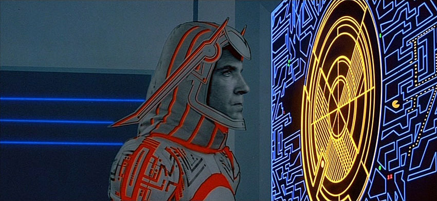
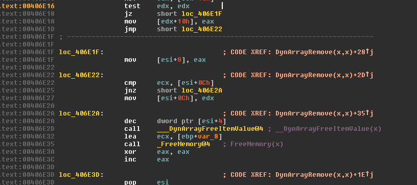

====
Sark
====

General
-------

IDA Plugins & IDAPython Scripting Library.

The library is in early development, so APIs are expected to change.

For documentation, see `sark.rtfd.org <http://sark.rtfd.org/>`_.

Highlights
----------

**Autostruct Plugin**

Dependencies
------------

1. `NetworkX <https://networkx.github.io/>`_
2. `AwesomeLib <https://github.com/tmr232/awesomelib>`_
3. `wrapt <https://pypi.python.org/pypi/wrapt>`_
4. `idacute <https://github.com/tmr232/cute>`_

Installation
------------

.. code:: bash

    pip install -U git+https://github.com/tmr232/Sark.git#egg=Sark

Or see `here <http://sark.readthedocs.org/en/latest/Installation.html>`_.

Plugins
-------

Plugin documentation can be found `here <http://sark.readthedocs.org/en/latest/plugins/index.html>`_.

Installation instructions can be found `here <http://sark.readthedocs.org/en/latest/plugins/installation.html>`_.

Other Useful Plugins
--------------------

1. `IDA IPython <https://github.com/james91b/ida_ipython>`_ - Run IPython inside IDA.
