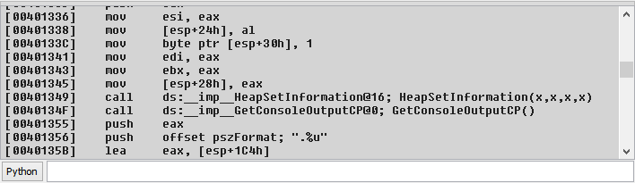
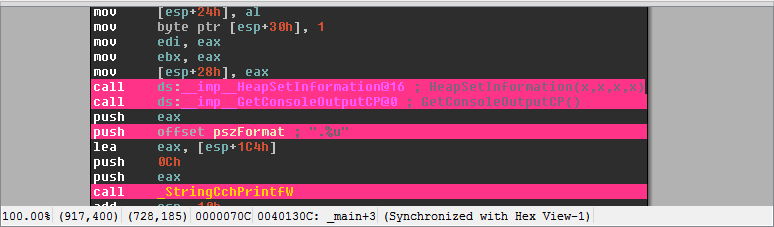

Welcome to the Sark Documentation!
==================================

.. image:: ./media/sark-pacman_small.jpg

Sark (named after the notorious Tron villain) is an object-oriented
scripting layer written on top of IDAPython. Sark is easy to use and
provides tools for writing advanced scripts and plugins.

Getting Started
===============

Install Sark from the command line::

   pip install -U git+https://github.com/tmr232/Sark.git#egg=Sark

Import inside IDA, and start having fun!

.. code:: python

   import sark
   import idaapi

   # Get the current function
   func = sark.Function()

   # Print all lines in the function
   for line in func.lines:
      idaapi.msg("{}\n".format(line))

.. code:: python

   # Mark all the lines containing xrefs outside the function
   for xref in func.xrefs_from:
      sark.Line(xref.frm).color = 0x8833FF

Table of Contents
=================

Contents:

.. toctree::
   :maxdepth: 2

   Introduction
   Installation
   api/index
   examples/index
   plugins/index
   debugging
   CONTRIBUTING
   AUTHORS
