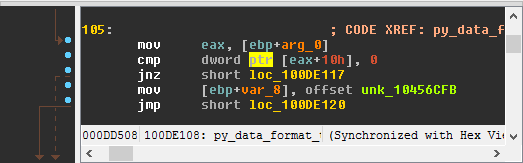
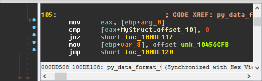
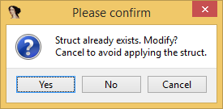
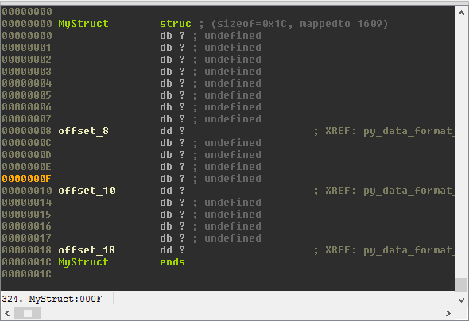

Autostruct
==========

Creating and applying structs in IDA can be quite a hassle.

Go to the structure window, create a structure, define members at specific offsets, go to the disassembly to apply
them, go back to the structure view to correct errors, apply other members... And on and on it goes.

The Autostruct plugin does all this work for you, without ever having to leave the IDA view.
It automatically creates structs, defines member offsets, and applies them in the disassembly view.

Usage
-----

1. Select a line (or lines) containing struct references
 |image1|
2. Press ``Shift + T``
3. Set the struct name
 |image2|
4. Choose the register holding the struct base for the selected code. Autostruct will automatically suggest the most likely candidate in the selection.
 |image3|

 At this point, Autostruct will try and create a new struct, populate it with relevant offsets, and apply it to the
 selection.

 |image4|
5. If a structure of the given name already exists, you will need to select whether to modify the existing structure, apply without modification, or cancel.
 |image5|
6. Struct creation and modification happen seamlessly
 |image6|

Known Issues
------------

Misaligned Member Creation
    When attempting to create a member at an offset belonging to another member, Autostruct will fail.
    This usually happens when a previous definition was incorrect (wrong member size) or when members are
    unions.
    At this point, manual handling (redefining the large member as a smaller one) is required.

.. |image2| image:: ../media/plugins/autostruct-2.png

