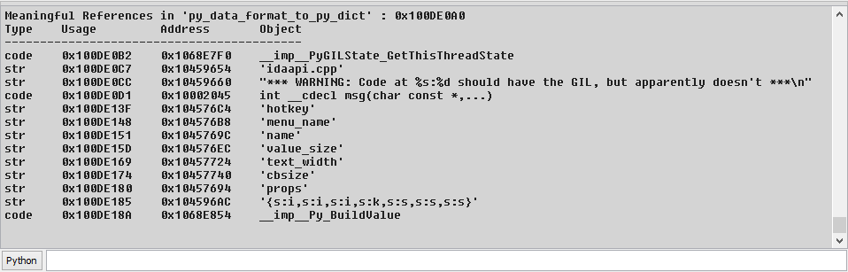
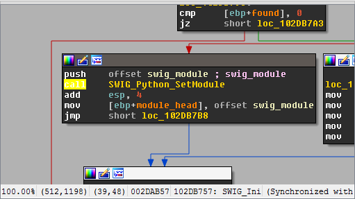
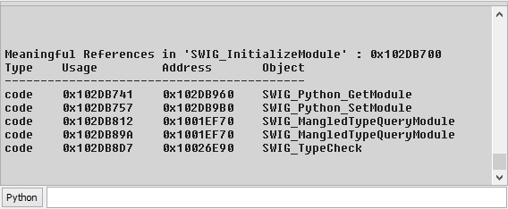

Show Meaningful
===============

When reversing an executable, we often need to deal with a large amount of unknown code.
To combat this, we usually look for strings and library functions, and use them as guides
as we interpret the code.
When those are ample, we hardly need to look at the assembly code to infer meaning.
On the other hand, the need to constantly jump into functions, pan them around to see all
the strings, then jump back out is quite time consuming and confusing.

Well, no more!

The "Meaningful" plugin allows you to get all the information you need with a simple hotkey.

Usage
-----

Whenever inside a function, just press ``Alt + 0`` to get a table of all the meaningful objects in it:

Since the output is at the `Output window`, a double click on an address will take you to it.

To make things even more agile, you can press ``Ctrl + Alt + 0`` whenever on a line referencing a function
to get the values displayed for that function:

