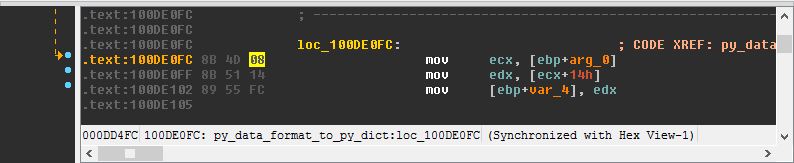
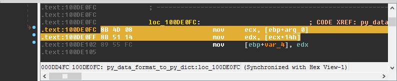

Quick Copy
==========

The quick copy allows you to easily copy data from the IDB.

Usage
-----

Copying Addresses
~~~~~~~~~~~~~~~~~

To copy the address of the current line, just press ``Ctrl + Alt + C``. It will get copied as a hex number, prefixed
with ``0x``.

To copy the file offset of the current line, simply press ``Ctrl + Alt + C + O``. It will get copied as a hex 
number (like line address copying), prefixed with ``0x``.

Copying Bytes
~~~~~~~~~~~~~

Pressing ``Ctrl + Shift + C`` copies the bytes of the current line or selection.

Copying the current line:

Will result in ``8b 4d 08``, while copying a selection:

Will result in ``8b 4d 08 8b 51 14``.
