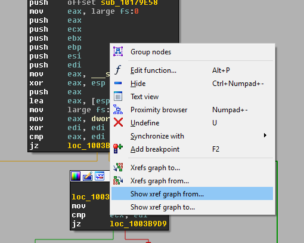
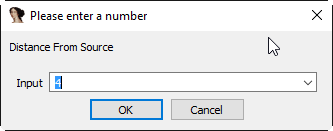
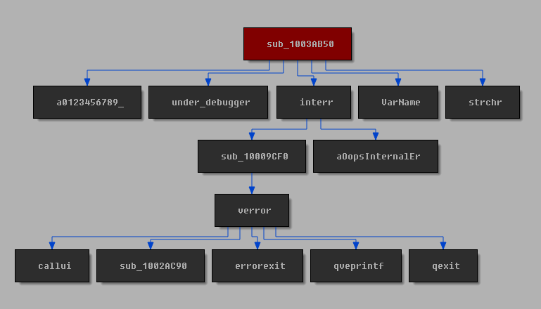

Xrefs Graph
===========

The Xrefs-Graph is used to easily generate interactive xref graphs.

Usage
-----

Anywhere within the IDA-View, just right-click [#pre67]_, and select the desired option:

In the popup dialog, enter the distance (recursion level) desired from the source:

Once you press ``OK``, the plugin will generate an interactive xrefs graph:

A double-click on any block will take you to the relevant address. Also, names in the blocks will be
updated as you rename functions.

Known Issues
------------

Node Groups
    While creation of node groups *is* possible via IDA's GUI, it is not presently supported in the plugin.
    Creation of node groups may cause unpredictable errors.

.. rubric:: Footnotes

.. [#pre67] In IDA 6.6 or earlier, use ``View/Graph/Xrefs from source`` or ``View/Graph/Xrefs to source``, as context
    menus cannot be augmented.